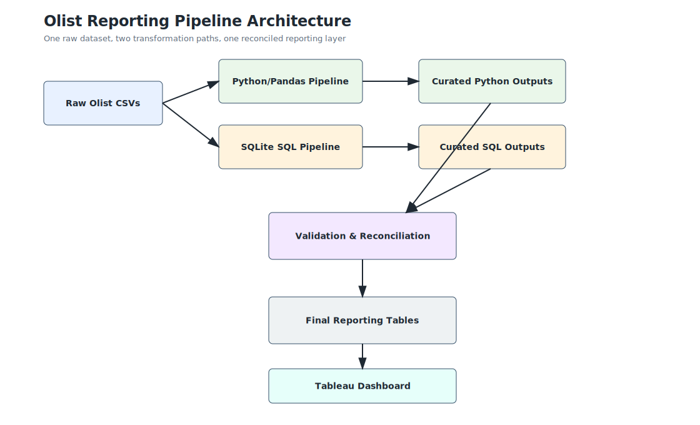
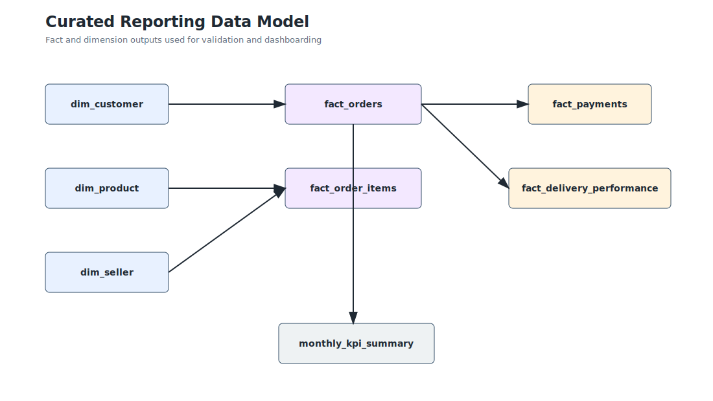
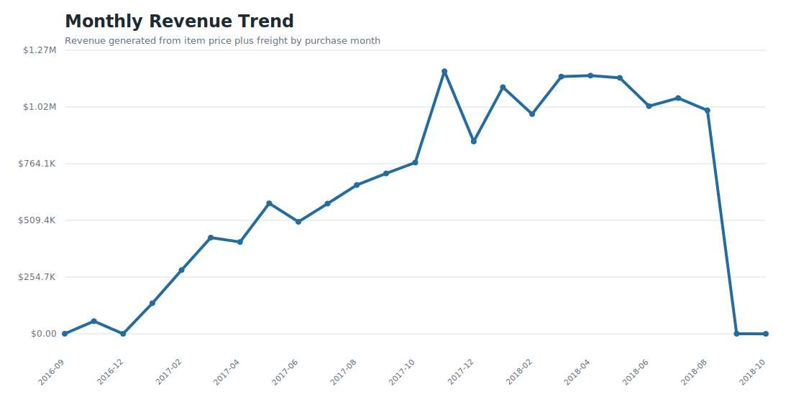
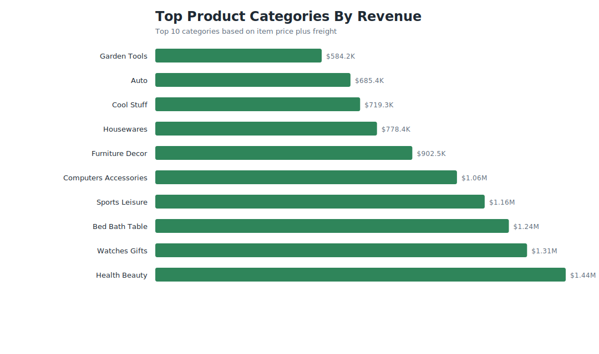
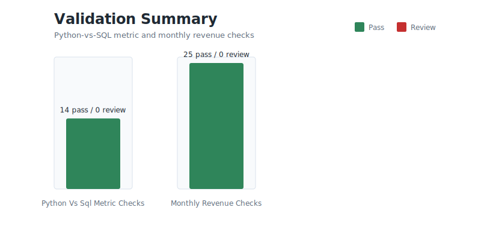
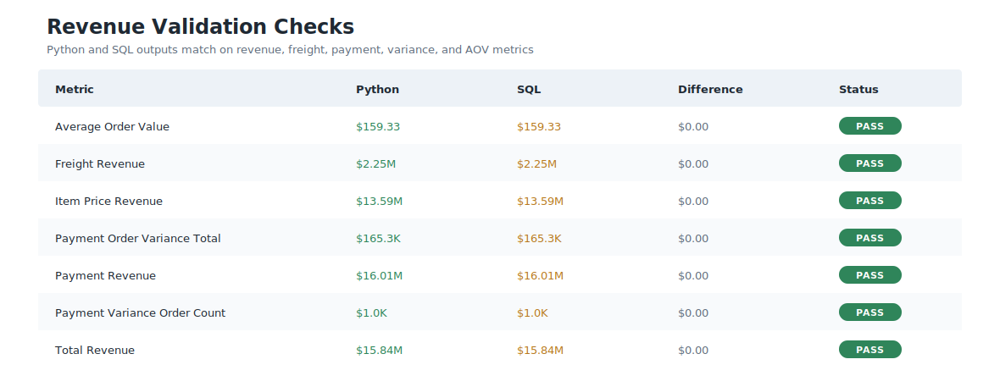

# E-Commerce Reporting Data Pipeline & Quality Control System

This portfolio project transforms the Olist Brazilian E-Commerce Public Dataset into validated reporting outputs using two parallel paths: Python/Pandas and SQLite SQL.

The goal is to demonstrate a professional reporting workflow:

```text
Raw Olist CSVs
  -> Python/Pandas pipeline
  -> curated Python outputs

Raw Olist CSVs
  -> SQLite SQL pipeline
  -> curated SQL outputs

Curated Python outputs + curated SQL outputs
  -> validation and reconciliation layer
  -> dashboard-ready reporting tables
```

## Business Problem

E-commerce reporting often depends on multiple operational tables: orders, order items, payments, customers, products, sellers, reviews, and delivery timestamps. If those tables are used directly in dashboards without profiling, cleaning, modeling, and reconciliation, teams can end up with inconsistent revenue totals, unclear delivery metrics, missing product categories, and unreliable seller or customer performance reporting.

This project builds a validated reporting layer and proves that the same business logic can be reproduced in Python and SQL.

## Data Source

- Source: Olist Brazilian E-Commerce Public Dataset on Kaggle
- URL: https://www.kaggle.com/datasets/olistbr/brazilian-ecommerce
- License: CC BY-NC-SA 4.0
- Use: Non-commercial portfolio and educational use with attribution

Raw CSV files are expected in `data/raw`.

## Completed Results

| Result | Value |
| --- | ---: |
| Orders modeled | 99,441 |
| Order items modeled | 112,650 |
| Monthly KPI rows | 25 |
| Total revenue | 15,843,553.24 |
| Delivered orders | 96,478 |
| Late delivered orders | 7,826 |
| Data quality issues logged | 2,440 |
| Python-vs-SQL metric checks passed | 14 of 14 |
| Monthly revenue checks passed | 25 of 25 |

## Visual Outputs













## Repository Structure

```text
ecommerce-reporting-pipeline-quality-control/
  README.md
  requirements.txt
  data/
    raw/
    cleaned_python/
    curated_python/
    curated_sql/
    validation_outputs/
  python/
    01_data_profile.py
    02_clean_with_pandas.py
    03_create_python_reporting_tables.py
    04_compare_python_sql_outputs.py
    05_run_sql_pipeline.py
    06_create_charts_and_diagrams.py
    common.py
  sql/
    01_create_tables.sql
    02_cleaning_views.sql
    03_reporting_layer.sql
    04_data_quality_checks.sql
    05_reconciliation_queries.sql
  docs/
  images/
```

## How To Run

Install dependencies:

```bash
pip install -r requirements.txt
```

Place the Olist CSV files in `data/raw`, then run:

```bash
python python/01_data_profile.py
python python/02_clean_with_pandas.py
python python/03_create_python_reporting_tables.py
python python/05_run_sql_pipeline.py
python python/04_compare_python_sql_outputs.py
python python/06_create_charts_and_diagrams.py
```

## Core Outputs

Python outputs are written to:

`data/curated_python`

SQL outputs are written to:

`data/curated_sql`

Validation outputs are written to:

`data/validation_outputs`

Key generated outputs:

- `fact_orders.csv`
- `fact_order_items.csv`
- `fact_payments.csv`
- `fact_delivery_performance.csv`
- `dim_customer.csv`
- `dim_product.csv`
- `dim_seller.csv`
- `monthly_kpi_summary.csv`
- `data_quality_issues.csv`
- `python_sql_comparison_summary.csv`
- `monthly_python_sql_revenue_comparison.csv`
- `reconciliation_summary.csv`

## Validation Checks

The reconciliation layer compares:

- Python total revenue vs SQL total revenue
- Python item price revenue vs SQL item price revenue
- Python freight revenue vs SQL freight revenue
- Python payment revenue vs SQL payment revenue
- Python payment/order variance vs SQL payment/order variance
- Python average order value vs SQL average order value
- Python order count vs SQL order count
- Python delivered order count vs SQL delivered order count
- Python late delivery count vs SQL late delivery count
- Python missing product category count vs SQL missing product category count
- Python unique customer count vs SQL unique customer count
- Python unique seller count vs SQL unique seller count
- Monthly Python total revenue vs monthly SQL total revenue

Completed validation result:

- 14 of 14 metric checks passed.
- 25 of 25 monthly revenue checks passed.

## Documentation

- `docs/business_problem.md`
- `docs/data_dictionary.md`
- `docs/metric_definitions.md`
- `docs/data_quality_rules.md`
- `docs/reconciliation_methodology.md`
- `docs/python_vs_sql_comparison.md`
- `docs/python_transition_journal.md`
- `docs/sql_transition_journal.md`
- `docs/project_3_4_build_plan.md`

## Project 4 Connection

Project 4, the Tableau dashboard, should use the curated Project 3 outputs instead of connecting directly to raw CSV files. That creates a stronger portfolio story:

```text
Raw operational data
  -> cleaned and validated reporting layer
  -> business-facing Tableau dashboard
```

Recommended Tableau inputs:

- `monthly_kpi_summary.csv`
- `fact_orders.csv`
- `fact_order_items.csv`
- `fact_delivery_performance.csv`
- `data_quality_issues.csv`
- `dim_customer.csv`
- `dim_product.csv`
- `dim_seller.csv`

## Portfolio Takeaway

This project shows the full reporting lifecycle: source profiling, cleaning, transformation, dimensional modeling, data quality checks, revenue reconciliation, SQL reproduction, documentation, and dashboard-ready outputs.
